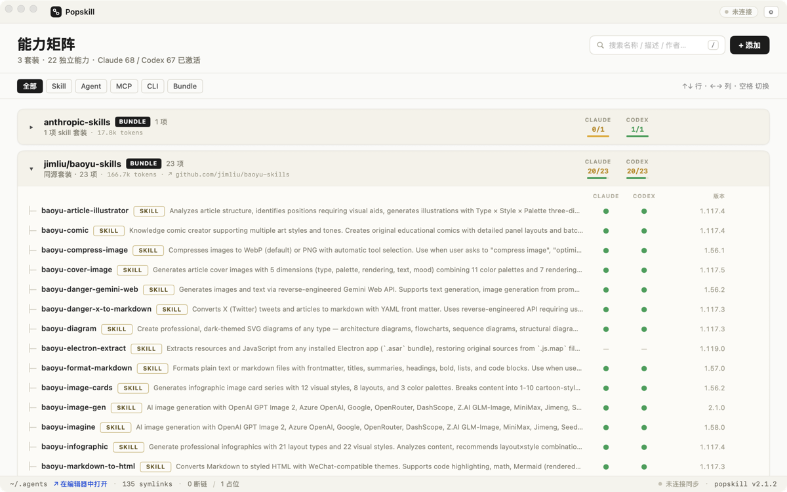
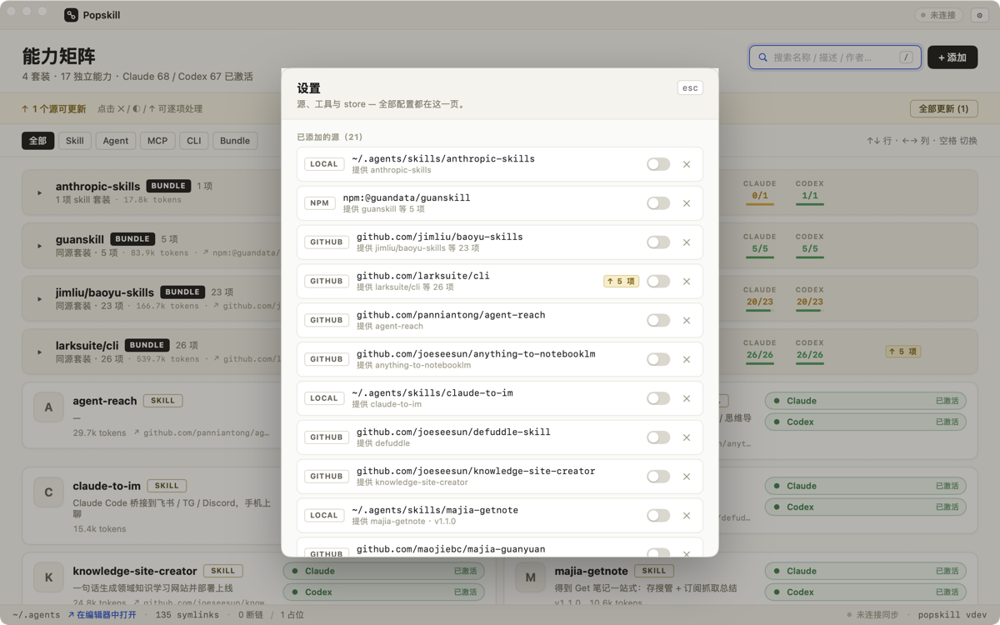
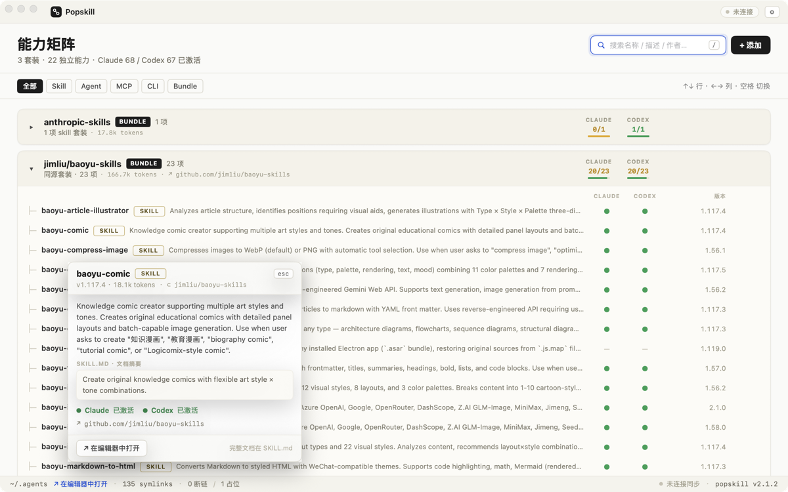
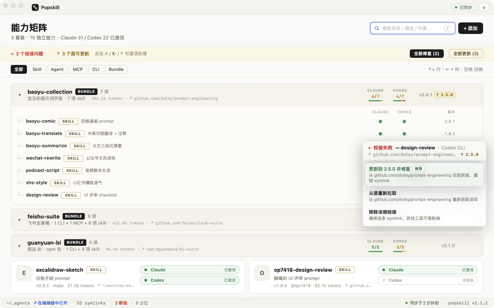
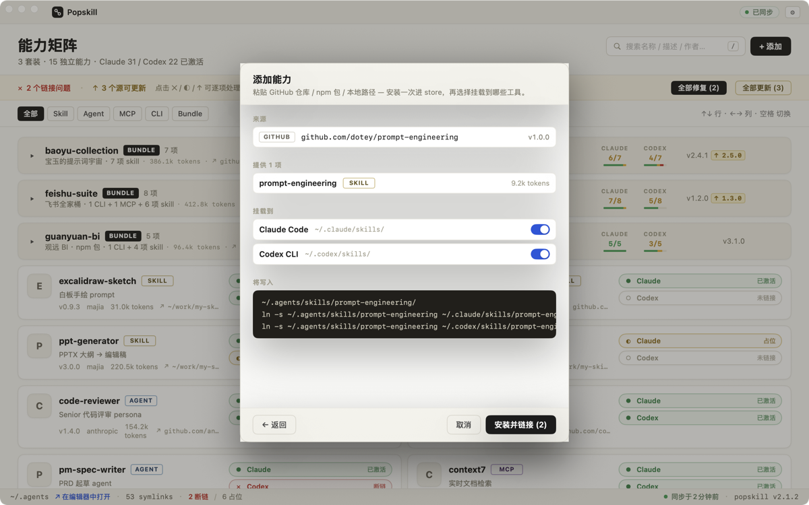
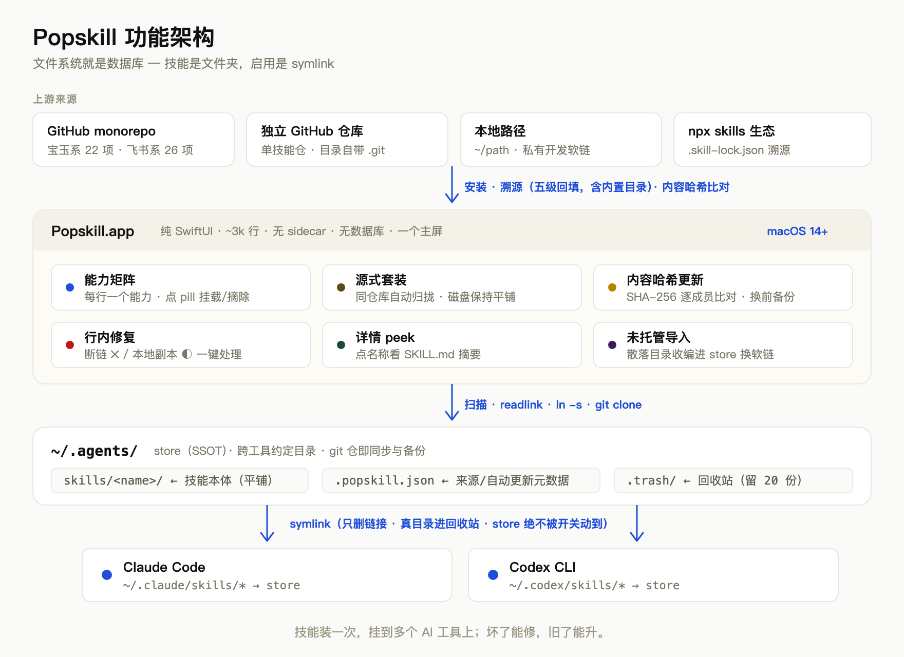

# Popskill

> **Local AI capability manager.** Install a skill once, mount it to every AI tool; fix what breaks, update what's stale. One ledger for all your Claude Code and Codex skills.

<p align="center">
  <a href="https://github.com/maojiebc/majia-Popskill/releases/latest">
    
  </a>
</p>

<p align="center">
  
  
  
  
  
</p>

> [中文 README](./README.md) · English

---

## Install

[**↓ Download Popskill (2.3 MB, signed + notarized)**](https://github.com/maojiebc/majia-Popskill/releases/latest/download/Popskill-2.4.2.dmg)

Requires macOS 14 (Sonoma) or newer. After first install, updates arrive in-app via Sparkle.

The DMG is Developer ID signed, notarized, and stapled — **no "unidentified developer" warning**.

---

## Why this exists

My Mac runs **72 skills from 9 upstreams using 6 mutually incompatible update mechanisms** — npm packages, git monorepos, standalone clones, `npx skills`, custom installers, marketplaces. Before Popskill, keeping it all fresh took a 178-line shell script on a launchd timer, and no tool could answer "what do I have, what's stale, which link is broken".

Popskill's answer builds on the simplest possible fact: **a skill is a folder, enabling it is a symlink.**

```text
~/.agents/skills/baoyu-comic/          ← store: the skill itself (installed once)
~/.claude/skills/baoyu-comic  → link   ← used by Claude Code
~/.codex/skills/baoyu-comic   → link   ← used by Codex
```

The filesystem is the database. No sidecar, no SQLite — your directory tree already is the complete state. Popskill just gives it a face you can see and click.

---

## Screenshots

<table>
<tr>
<td></td>
<td></td>
</tr>
<tr>
<td><b>Automatic provenance</b> — five-level backfill (lock file / git remote / frontmatter / curated catalog); installed skills know where they came from</td>
<td><b>Detail peek</b> — click a name for the SKILL.md digest; deep reading happens in your editor</td>
</tr>
<tr>
<td></td>
<td></td>
</tr>
<tr>
<td><b>Inline repair</b> — broken links / local copies handled in place; recommended option highlighted</td>
<td><b>Install plan</b> — paste a URL, see exactly what will be written (ln -s preview) before installing</td>
</tr>
</table>

---

## Features

- **Capability matrix** — every skill in one ledger: one row per capability, Claude / Codex status pills, one click to mount or unmount
- **Source bundles** — skills from the same upstream repo auto-group into one card (e.g. 22 baoyu skills, 26 lark skills); disk stays flat, symlinks untouched
- **Content-hash updates** — no semver required: per-member SHA-256 against upstream; one clone checks a whole monorepo, only changed members get replaced, and you're told about upstream skills you haven't installed yet
- **Backup before update** — replaced versions go to a recycle bin (20 kept), restorable anytime
- **Inline repair** — broken links and unmanaged local copies fixed in place; destructive operations only ever touch symlinks, real directories go to the recycle bin
- **Unmanaged import** — one click adopts stray skill folders from `~/.claude` / `~/.codex` into the store, replaced with symlinks
- **Keyboard navigation** — `↑↓` row focus, `←→` tool column, `Space` to toggle or repair, `/` search, `Esc` to exit
- **Curated catalog** — built-in one-line Chinese summaries and type hints for ~80 popular skills; no more raw upstream walls of text on cards

---

## Quickstart

1. Install and launch — if you already use `~/.agents/skills/` (the `npx skills` ecosystem convention), the matrix fills with your existing skills immediately
2. Starting fresh? Hit **+ Add** and paste a GitHub repo, e.g. `github.com/anthropics/skills`
3. Click the Claude / Codex pill on a card to mount; click ✕ or ◐ to repair; flip on auto-update in Settings

---

## How it works

<p align="center">
  
</p>

*(diagram labels are in Chinese; the flow reads: upstream sources → Popskill's six modules → the `~/.agents` store → symlinks consumed by Claude Code / Codex CLI)*

Provenance is a five-level backfill: Popskill's own install records → `.skill-lock.json` (the `npx skills` lock file) → the skill folder's git remote → SKILL.md frontmatter homepage → the built-in curated catalog (rescuing copy-installed "provenance orphans" like the guanskill family). Update detection hashes directory contents (SHA-256), so **skills without proper version numbers still get update detection**.

---

## FAQ

**Q: Why not the Mac App Store?**
The App Store sandbox won't let an app manage symlinks in `~/.claude` and `~/.codex`. Direct distribution is what makes the app able to do its job. Signing + notarization provide equivalent safety.

**Q: Any data collection?**
No. 100% local, no analytics, no telemetry. The only network calls: `git clone` of your own skills' upstream repos during update checks, and Sparkle checking for app updates.

**Q: Where is data stored? How do I uninstall?**
Skills live in `~/.agents/` (your data, not Popskill's); the app's own metadata is a single `~/.agents/.popskill.json`. Uninstall = drag Popskill.app to Trash; your skills and symlinks stay intact.

**Q: Will it touch my files?**
Three hard safety rules: only symlinks are ever deleted; real directories always go to the recycle bin (`~/.agents/.trash/`, 20 kept); store directories are never touched by toggles. 40 engine unit tests enforce these.

**Q: Tools beyond Claude Code / Codex?**
The tool list is dynamic in the architecture, but this version deliberately ships with just these two (my actual daily need). Tools that natively scan `~/.agents/skills/` (like opencode) work with zero configuration.

**Q: Windows / Linux?**
No. Pure SwiftUI, Mac only.

---

## Releases

Current: [v2.4.2](https://github.com/maojiebc/majia-Popskill/releases/tag/v2.4.2) · all versions on [Releases](https://github.com/maojiebc/majia-Popskill/releases) · changelogs in `docs/release/`

v2 is a first-principles rewrite (one screen, filesystem as database). v1.x (sidecar architecture) has been retired; design history is archived in `docs/design/`.

---

## Acknowledgments

- **[CC Switch](https://github.com/farion1231/cc-switch)** — where this project started. Popskill v1 used its Rust services layer as the storage engine via a zero-fork git submodule; and although v2 went pure-Swift against the filesystem, v2.1's update machinery — content-hash comparison against upstream, automatic backup before update, per-app enable flags — is directly modeled on its skill management design.
- **[Sparkle](https://sparkle-project.org)** — the de-facto standard for Mac in-app updates, powering this app's update delivery.
- **The `npx skills` ecosystem** — the `~/.agents/skills/` cross-tool convention and the `.skill-lock.json` lock file are the foundation of Popskill's provenance detection and interoperability.

---

## 👤 Author / Contact

**Majia (@maojiebc)** · 超级马甲 (Super Majia)

If this Mac app helps you, find me on any of these channels — happy to chat about field experience, take feature requests, hear bug reports, or trade notes on Mac app development / user operations / AI toolchain integration:

| Channel | Link |
|---|---|
| 📧 Email | [m9224@163.com](mailto:m9224@163.com) |
| 🐙 GitHub | [github.com/maojiebc](https://github.com/maojiebc) |
| 🪝 ClawHub | [clawhub.ai/p/maojiebc](https://clawhub.ai/p/maojiebc) |
| 🐦 X | [@maojiebc](https://x.com/maojiebc) |
| 📕 Xiaohongshu | [Super Majia](https://xhslink.com/m/4fQMJeHHWKC) |
| 📰 WeChat Official Account | **超级马甲** |

> Built from 14 years of user-operations work + hands-on macOS app development.

## License

[MIT](./LICENSE)
