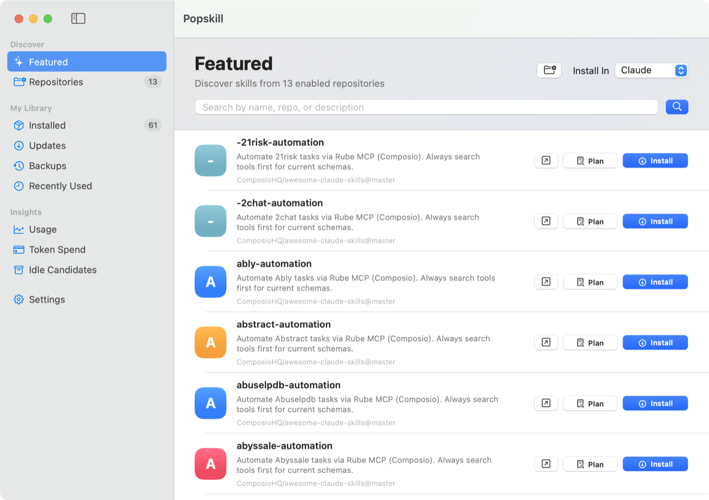
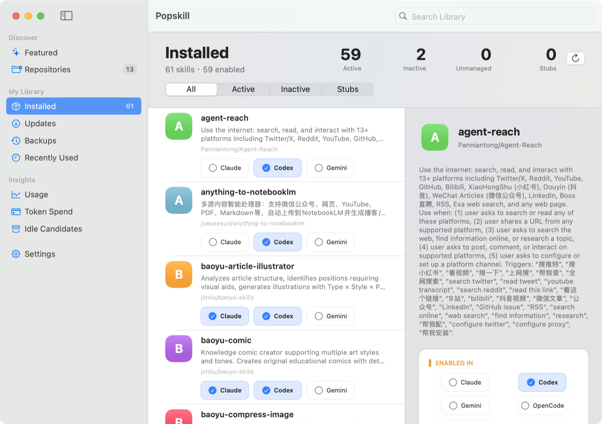
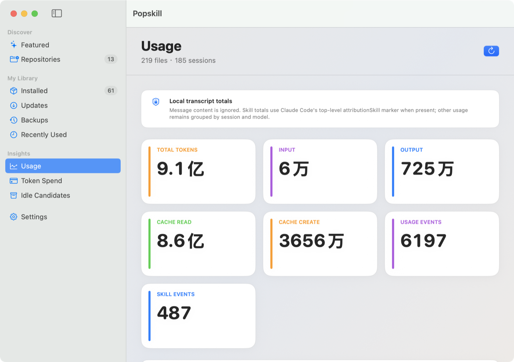
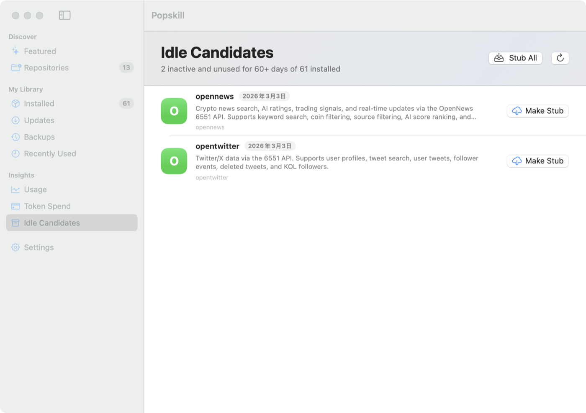

# Popskill

> The Mac App Store for AI capabilities, starting with Claude Code Agent Skills.
> Mac 上的 AI 能力 App Store，从 Claude Code Agent Skills 开始。

<p align="center">
  <strong>Status: Pre-alpha — MVP feature verticals compile and pass local CI; v0.1 release hardening is in progress.</strong>
</p>

---

## English (TL;DR)

Popskill aims to be the Mac App Store for AI capabilities, starting with the App Store experience that Claude Code skills deserve on Mac:

- **Mac-native SwiftUI design** (inspired by Surge for Mac)
- **Multi-app toggles** for Claude / Codex / Gemini / OpenCode / Hermes (quick row toggles for the common three, full controls in detail)
- **Usage Insights** — token spend, top skills, hibernate candidates (parses `~/.claude/projects/*.jsonl`). No other tool does this.
- **Stub state** — like App Store's "purchased but not downloaded"; reclaim disk without losing the card
- **WebDAV sync** across devices (reuses [CC Switch](https://github.com/farion1231/cc-switch)'s implementation — zero re-implementation)
- **Local Agent library** for `~/.claude/agents` role/persona files
- **AgentShield security scan** for third-party skill installs (persisted Library badges; see [PLAN.md §11.8](./PLAN.md#118-第三方-skill-安全审计agentshield))

**Architecture**: SwiftUI front-end → `skill-cli` Rust sidecar → `cc_switch_lib` (CC Switch as git submodule, **zero fork, zero patch**).

**Current stage**: MVP feature verticals are implemented locally. `skill-cli` is wired to CC Switch for list/detail/toggle/discover/install-plan/install/update/uninstall/import/repository/backup/WebDAV status/config/remote-info/sync-plan flows, plus read-only `agent-list`, `agent-targets`, `agent-catalog`, and `agent-install-plan` flows for local Claude Code agents, Agent-capable tools, and AgencyAgents content; SwiftUI Library + Agents + Discover + Repositories + Updates + Backups + Insights + Settings compile and pass tests; `scripts/ci-local.sh` verifies Rust/Swift builds, read-only sidecar/Agent smoke, native launch smoke, bundle smoke, screenshot asset smoke, and release artifact smoke. Remaining v0.1 work is release hardening: Developer ID signing/notarization, Sparkle public feed/key/signature verification, WebDAV manual sync, and final screenshot QA. See [PLAN.md](./PLAN.md) and [STYLE.md](./STYLE.md) for the full picture.

## Where Popskill Fits

Popskill is part of a growing AI tools ecosystem. It complements these excellent projects instead of pretending the category starts here:

- **Anthropic MCP Registry**: the upstream DNS for MCP servers. Popskill consumes registry metadata; it is not a registry.
- **Smithery, Glama, MCPHub, MyMCP**: strong MCP-focused discovery and management projects. Popskill goes broader by adding Skills, Agents, CLI tools, and Config.
- **Dify**: the Bundle concept pioneer in web LLM platforms. Popskill brings the capability-package idea to native Mac and local AI clients.
- **everything-claude-code (ECC)** and **agency-agents**: rich content sources for Skills and Agents. Popskill is a GUI consumer and local manager for that content.
- **iamzhihuix/skills-manage** and **yibie/skills-manager**: skill-focused managers. Popskill's long-term direction is cross-form capability packages with Mac-native UX.

The planned v0.2 Package model is therefore not "first ever"; it is Popskill's attempt to make the full combination work on Mac: **Skill + Agent + CLI + MCP + Config**, across AI tools, with App Store-level UX, Usage Insights, Stub, and AgentShield.

## Screenshots



<p align="center">
  
  
</p>



---

## 中文版

### 它是什么

Claude Code 的 Agent Skills 生态在 GitHub 上已经爆炸（[anthropics/skills](https://github.com/anthropics/skills) 13万⭐、各种 awesome-list 60万+⭐ 总和），AgencyAgents 这类仓库也证明了 Agent 角色库正在变成中文圈高频入口；但**没有一个 Mac 客户端把"发现 / 安装 / 管理 / 统计"做成 App Store 那种体验**。

Popskill 就是来填这个坑的。

### 它跟现有方案差在哪

| 工具 | 缺点 |
|---|---|
| **[CC Switch](https://github.com/farion1231/cc-switch)** (6.8万⭐) | 功能太杂（6 种 CLI + Provider + Skill 全塞一起），新手找不到入口；多 app toggle 必须进详情页 |
| **[skills-manage](https://github.com/iamzhihuix/skills-manage)** (1814⭐) | 同赛道头部，但不是 Mac 原生质感，公开包未 notarize，且没有 Usage Insights / Stub |
| **[skills-manager](https://github.com/yibie/skills-manager)** (152⭐) | SwiftUI 技术栈撞车，但视觉偏标准控件，没有 Usage Insights / Stub / WebDAV |
| **[agent-skills-guard](https://github.com/bruc3van/agent-skills-guard)** (354⭐) | 只做安全扫描，没有 App Store 发现/统计 |
| **[vercel-labs/skills](https://github.com/vercel-labs/skills)** (1.8万⭐) | CLI 工具，无 GUI |
| 一众 0-star `claude-skill-manager` | 没人做出 App Store 体验 |

**Popskill 的差异点**：

1. **Mac App Store 级别的视觉**——SwiftUI 原生，配 Surge for Mac 设计语言
2. **使用统计 / Insights 页**（全网独家）——告诉你装的几十个 skill 里哪些值得保留
3. **多 app toggle**——Library 列表行内切 Claude/Codex/Gemini，详情页支持 OpenCode/Hermes
4. **Stub 状态**——60 天没用的 skill 本地清掉内容、留 metadata 卡片，要用一键再装
5. **WebDAV 跨设备同步**——白嫖 CC Switch 已有能力，不重做
6. **Agent 本地管理**——把 `~/.claude/agents` 里的角色/persona 文件纳入同一个 Library 视图，先只读列表，后续再接 AgencyAgents/ECC 来源
7. **AgentShield 安全审计**——第三方 skill 安装后立即扫描，blocked 自动回滚，安全状态显示到列表和详情页

### 中文用户生态

Popskill 跟 [agency-agents](https://github.com/msitarzewski/agency-agents) 是上下游关系：agency-agents 提供 Agent 内容池，Popskill 负责本地管理体验。它已经覆盖小红书、知乎、抖音、B站、微信、百度 SEO、跨境电商、直播带货等中文圈角色；Popskill 先接本机 Agent 列表和工具 target 诊断，后续再把它作为首批 Agent 内容源。

### 技术架构（一句话）

```
SwiftUI 前端 (macOS 14+)
    ↓ Process.run
skill-cli (Rust sidecar)
    ↓ pub use SkillService
cc_switch_lib (CC Switch 当 git submodule，一行不改)
```

我们**不 fork、不 patch CC Switch**，纯 Rust path 依赖。详见 [PLAN.md §4 技术架构](./PLAN.md#4-技术架构)。

### 当前状态

| 阶段 | 状态 |
|---|---|
| B. 摸 CC Switch 源码 | ✅ Done |
| A. Sidecar 剥离可行性 | ✅ 静态分析通过（lib.rs:52-56 已 pub use SkillService） |
| C. 产品形态 V1 | ✅ 5 个页面 wireframe + 状态机 + 16 条决策 |
| D-prep. 视觉设计语言 | ✅ Surge.app 拆解 + 22 个 design token |
| **D. MVP 主链路** | ✅ sidecar + SwiftUI Library/Agents/Discover/Repositories/Updates/Backups/Insights/Settings 已可编译并通过本地 CI |
| **E. v0.1 发布收口** | 🚧 签名/公证、Sparkle public feed/key/signature 验证、WebDAV 手动同步；README 截图、主要页面截图级 polish、WebDAV 配置写入、Sparkle SDK link/readiness hooks 与 transcript skill attribution 已完成 |

**这个仓库目前是 pre-alpha**：已有 Rust sidecar、SwiftUI Library/Agents/Discover/Repositories/Updates/Backups/Insights/Settings 页面、transcript scanner 单测和本地 CI。Stub 与 AgentShield 已有可用纵切；Agent 管理目前完成本机 `~/.claude/agents` 只读列表/搜索/分类详情、Agent-capable target 诊断、AgencyAgents catalog 预览和安装计划预览；WebDAV 目前完成状态/远端 snapshot 读取与配置写入，手动 Sync Now 仍受 CC Switch Tauri State/private module 边界阻塞。正式签名、公证、Sparkle 公开 feed/key/signature 实测和 App Store 分发还没完成；本地 DMG、release manifest、appcast 生成、Sparkle SDK link/配置守卫与 notarize 脚本骨架已先落位。

### 已落地的 MVP 能力

```bash
./skill-cli/target/debug/skill-cli health --json
./skill-cli/target/debug/skill-cli webdav-status --json
POPSKILL_WEBDAV_PASSWORD='<password>' ./skill-cli/target/debug/skill-cli webdav-configure --base-url <url> --username <user> --password-env POPSKILL_WEBDAV_PASSWORD --remote-root cc-switch-sync --profile default --enabled true --auto-sync false --json
./skill-cli/target/debug/skill-cli webdav-remote-info --json
./skill-cli/target/debug/skill-cli webdav-sync-plan --json
./skill-cli/target/debug/skill-cli list --json
./skill-cli/target/debug/skill-cli agent-list --json
./skill-cli/target/debug/skill-cli agent-targets --json
./skill-cli/target/debug/skill-cli agent-catalog --query xiaohongshu --limit 10 --json
./skill-cli/target/debug/skill-cli agent-install-plan msitarzewski/agency-agents:marketing/marketing-xiaohongshu-specialist --target claude-code --json
./skill-cli/target/debug/skill-cli detail <skill-id> --json
./skill-cli/target/debug/skill-cli toggle <skill-id> --app codex --enabled true --json
./skill-cli/target/debug/skill-cli scan-unmanaged --json
./skill-cli/target/debug/skill-cli discover --query pdf --limit 20 --json
./skill-cli/target/debug/skill-cli repo-list --json
./skill-cli/target/debug/skill-cli repo-add --owner <owner> --name <repo> --branch main --enabled true --json
./skill-cli/target/debug/skill-cli repo-toggle --owner <owner> --name <repo> --enabled false --json
./skill-cli/target/debug/skill-cli repo-remove --owner <owner> --name <repo> --json
./skill-cli/target/debug/skill-cli install-plan <skill-key> --app codex --json
./skill-cli/target/debug/skill-cli install <skill-key> --app codex --json
./skill-cli/target/debug/skill-cli check-updates --json
./skill-cli/target/debug/skill-cli update <skill-id> --json
./skill-cli/target/debug/skill-cli uninstall <skill-id> --json
./skill-cli/target/debug/skill-cli stub-list --json
./skill-cli/target/debug/skill-cli stub <skill-id> --json
./skill-cli/target/debug/skill-cli rehydrate <skill-id> --app codex --json
./skill-cli/target/debug/skill-cli security-scan /path/to/skill --skill-id <skill-id> --json
./skill-cli/target/debug/skill-cli security-scan-list --json
./skill-cli/target/debug/skill-cli backup-list --json
./skill-cli/target/debug/skill-cli backup-restore <backup-id> --app codex --json
./skill-cli/target/debug/skill-cli backup-delete <backup-id> --json
./skill-cli/target/debug/skill-cli import-unmanaged <directory> --app codex --json
```

SwiftUI 端已接入：

- Library：本机 skill 列表、All/Active/Inactive/Stubs 过滤、Claude/Codex/Gemini 行内 toggle、详情页 5 App toggle、stub/rehydrate、AgentShield 持久化角标与手动扫描、unmanaged import 前扫描
- Agents：本机 Claude Code Agent 列表，读取 `~/.claude/agents/**/*.md` frontmatter，支持搜索、分类筛选、详情、打开源文件和 Agent target 诊断
- Discover：搜索 CC Switch 启用的 skill repositories，行内 install-plan 预览，按 Claude/Codex/Gemini/OpenCode/Hermes 安装，安装后跑 AgentShield，blocked 自动回滚
- Repositories：查看、启停、删除 CC Switch skill discovery sources
- Updates：按需检查更新、逐条更新、Update All 批量更新、last checked 状态
- Backups：查看、恢复、删除 CC Switch uninstall backups
- Insights：本地扫描 `~/.claude/projects/**/*.jsonl`，聚合 token/session/file/model/skill 指标；skill 归因使用 Claude Code 顶层 `attributionSkill` 字段且忽略正文；Idle Candidates 会避开 60 天内有真实归因使用的 skill
- Settings：sidecar 路径、`POPSKILL_CLI` override、CC Switch skill store、WebDAV 配置/状态/远端 snapshot 与密钥边界诊断

### v0.1 发布门槛

- ✅ 本地 CI：`./scripts/ci-local.sh` 覆盖 Rust/Swift build、单测、只读 sidecar/Agent smoke、App 启动、bundle 启动、screenshot asset smoke、release artifact smoke。
- ✅ Release artifact smoke：可生成本地开发 DMG、release manifest、Sparkle appcast 骨架。
- ✅ Release doctor：`scripts/release-doctor.sh` 可检查 Developer ID、notarytool/stapler、notary 凭据、bundle/DMG/release manifest 一致性、appcast 前置条件和 Sparkle framework/rpath/metadata。
- ✅ Transcript attribution：Insights 本地聚合且忽略正文；真实 transcript 已验证 `attributionSkill` / `attributionPlugin` 字段，Usage / Token Spend 已展示 skill 级统计，Idle Candidates 已接入最近使用归因。
- ✅ Discover/Library visual pass：Discover 行内 `Plan` / `Install` CTA 可读；带计数的 sidebar 导航可点；Library 行内 app toggle 不再挤压技能标题。
- ✅ Settings/Updates visual pass：Settings 诊断字段更紧凑；Updates 空态不再显示不可点的主按钮。
- ✅ Screenshot asset smoke：本地 CI 校验 README 截图存在、PNG 格式、尺寸、文件大小和基础像素方差。
- ⏳ Apple Developer Program：确认 Developer ID 证书；不加入则需要明确 unsigned/ad-hoc 分发说明。
- ⏳ Notarization：拿到证书后跑 `scripts/notarize.sh`，验证 `stapler validate` 和 Gatekeeper 打开路径。
- ✅ Sparkle SDK link：App 已正式链接 Sparkle 2.9.1，`Check for Updates...` 配置守卫、bundle `Sparkle.framework` copy、`SUFeedURL` / `SUPublicEDKey` 注入与 appcast 生成路径可用；公开更新仍需真实 feed、public EdDSA key 和 signed notarized payload 验证。
- ✅ WebDAV config：Settings 可写入 CC Switch WebDAV 配置；新密码通过环境变量进入 sidecar，状态输出继续脱敏。
- ⏳ WebDAV Sync Now：upload/download 仍受 CC Switch Tauri State/private module 边界阻塞；`webdav-sync-plan` 已把不可用原因和安全只读动作结构化输出，暂不复制同步协议实现。
- ✅ README 截图：Discover、Library、Usage Insights、Idle Candidates 真实界面截图已补到 `docs/assets/screenshots/`。
- ⏳ 最终视觉验收：发布前再做一次全局截图 QA。

### Roadmap

**v0.2 will introduce the Package abstraction**：一个 Package 代表完整 AI 能力（例如飞书、GitHub、PDF），可打包 CLI、MCP、Skills、Agents 和 Config。Popskill 会从 "Claude Code skill manager" 进化为 "AI Capability App Store"，但 v0.1 仍先保持当前 Skill 中心化范围发布。

### 文档导航

- **[PLAN.md](./PLAN.md)** —— 产品 + 工程规划，自包含。新机器接手只需读这一份。
  - §0-2：怎么用 + 16 条核心决策
  - §3：产品形态（5 页 wireframe + 状态机）
  - §4-8：技术架构 + 数据模型 + Sidecar 接口
  - §9：第一周 Day 1-5 milestone（已完成）
  - §10：Week 2-8 进度校准 + v0.1 收口清单
  - §11：已知坑 / 风险预案
  - §15：v0.2 Package 能力包重构
  - 附录 A：新电脑接手 6 步 checklist

- **[STYLE.md](./STYLE.md)**（~840 行）—— 视觉设计语言，含立即可用的 SwiftUI design token 代码。
- **[docs/ipc.md](./docs/ipc.md)** —— SwiftUI ↔ `skill-cli` JSON 合约。
- **[docs/transcript-parsing.md](./docs/transcript-parsing.md)** —— Claude transcript 字段观察和 Insights MVP 策略。
- **[docs/security.md](./docs/security.md)** —— Keychain、skill 内容和 transcript insights 的安全边界。
- **[docs/release-runbook.md](./docs/release-runbook.md)** —— v0.1 签名、公证、DMG 和 Sparkle appcast 发布步骤。
- **[docs/v0.1-release-readiness.md](./docs/v0.1-release-readiness.md)** —— 当前 v0.1 dry-run 结果、通过项和剩余外部门槛。
- **[docs/release-notes-v0.1.md](./docs/release-notes-v0.1.md)** —— v0.1 pre-alpha 发布说明草稿。
- **[docs/v0.1-qa-checklist.md](./docs/v0.1-qa-checklist.md)** —— v0.1 发布前自动/视觉/隐私/发布产物 QA 清单。

### 在新机器上接手

```bash
# 装工具链
xcode-select --install
curl --proto '=https' --tlsv1.2 -sSf https://sh.rustup.rs | sh
brew install gh jq

# 拉项目
gh repo clone maojiebc/majia-Popskill ~/projects/popskill -- --recurse-submodules
cd ~/projects/popskill

# 一键开发构建
./scripts/dev-build.sh

# 本地 CI（构建、测试、只读 smoke、App 启动 smoke、bundle/release smoke）
./scripts/ci-local.sh

# 需要额外覆盖写入型 repo 命令时
./scripts/ci-local.sh --mutating

# 原生 app 启动烟测
./scripts/smoke-app.sh

# 显式写入型 sidecar smoke（会创建并删除一个临时 repo）
./scripts/smoke-cli-mutating.sh

# 生成本地开发 .app bundle（内含 skill-cli sidecar）
./scripts/package-dev-app.sh

# 验证 .app bundle 能使用内置 skill-cli 启动
./scripts/smoke-bundle.sh

# 生成本地开发 DMG（含 Applications 拖拽入口），并输出 sha256
./scripts/package-dmg.sh

# 检查 Developer ID / notarization / appcast 发布前置条件（不签名、不上传）
./scripts/release-doctor.sh

# 公开发布时，把 dev metadata 与缺失的 feed/key/download/signature/appcast 从 warning 提升为 failure
POPSKILL_REQUIRE_RELEASE_METADATA=true POPSKILL_REQUIRE_SPARKLE=true ./scripts/release-doctor.sh

# 生成 release metadata（version / build / dmg sha256 / size）
./scripts/release-manifest.sh

# 从 release metadata 生成 Sparkle appcast 骨架（正式发布时传真实下载 URL/签名）
POPSKILL_APPCAST_DOWNLOAD_URL="https://<your-release-host>/Popskill.dmg" \
./scripts/generate-appcast.sh

# 查询/生成 Sparkle EdDSA public key，签名 DMG 并输出 POPSKILL_SPARKLE_ED_SIGNATURE
./scripts/sparkle-generate-keys.sh
./scripts/sparkle-sign-update.sh build/Popskill.dmg

# v0.1 发布前的签名/公证骨架（需要 Apple Developer ID 凭据）
POPSKILL_APP_VERSION="0.1.0" \
POPSKILL_APP_BUILD="1" \
POPSKILL_BUNDLE_IDENTIFIER="com.maojiebc.popskill" \
POPSKILL_DEVELOPER_ID_APPLICATION="Developer ID Application: Name (TEAMID)" \
POPSKILL_APPLE_ID="you@example.com" \
POPSKILL_TEAM_ID="TEAMID" \
POPSKILL_NOTARY_PASSWORD="app-specific-password" \
./scripts/notarize.sh

# 本地启动 SwiftUI app
./scripts/run-app.sh
```

详见 [PLAN.md 附录 A](./PLAN.md#附录-a新电脑接手-checklist)。

### 致谢 / Credits

这个项目站在三类巨人肩膀上：

- **[CC Switch](https://github.com/farion1231/cc-switch)** by Jason Young — services 层写得极其干净（0 处 Tauri 耦合在 3042 行业务逻辑里），让 sidecar 路线变成 1 周的活而不是 4 周
- **[Surge for Mac](https://nssurge.com/)** — 视觉设计语言的主要灵感来源（仅参考设计，不复制资源）
- **[Anthropic Skills](https://github.com/anthropics/skills)**、[vercel-labs/skills](https://github.com/vercel-labs/skills) 和 [awesome-claude-skills](https://github.com/ComposioHQ/awesome-claude-skills) 等一票 awesome-list — 内容生态的基础设施

### 协作 / Contributing

这是 pre-alpha，主仓库还在私有阶段的话不建议提 PR。等 v0.1 发布后会写 CONTRIBUTING.md。

如果你对设计/架构有想法，欢迎在 Issues 讨论。

### Maintainer Governance

- Do not push, rewrite git history, drop stashes, or change the `cc-switch/` submodule without maintainer approval.
- Small reversible exploration is allowed during v0.1 only when it stays behind an existing secondary view, documentation, or read-only preview.
- Changing the primary product abstraction, sidebar structure, release path, or PLAN.md core positioning requires maintainer approval first.

### License

[MIT](./LICENSE)
