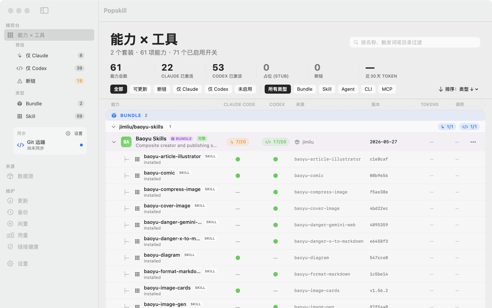
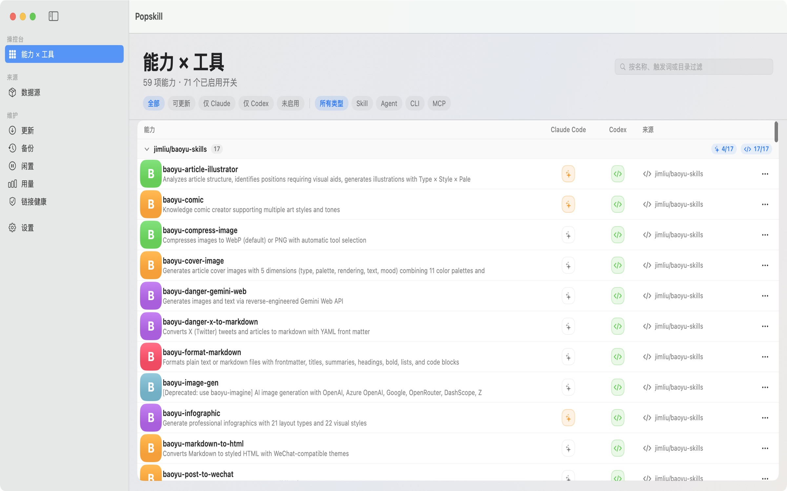
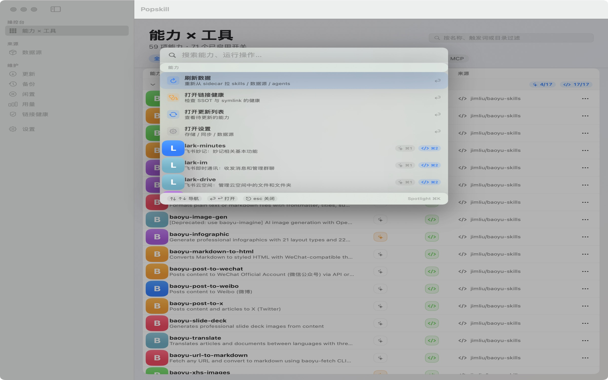
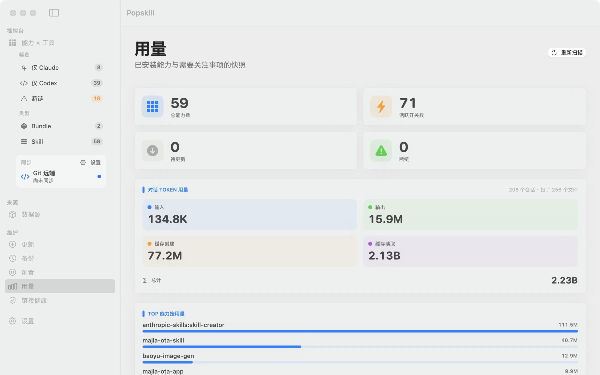
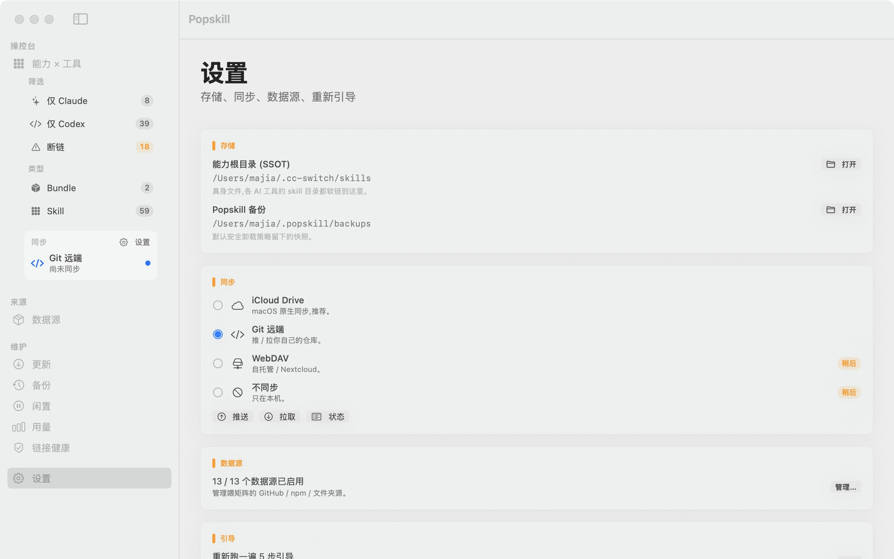

# Popskill

> **Mac 上 AI 能力的统一控制台**。把 Claude Code 和 Codex 的 skill / agent / CLI / MCP 全摆成一个矩阵，一键开关、链接健康、iCloud 同步。

<p align="center">
  <a href="https://github.com/maojiebc/majia-Popskill/releases/latest/download/Popskill-1.1.0.dmg">
    
  </a>
</p>

<p align="center">
  
  
  
  
  
</p>

> 中文 · [English README](./README.en.md)

---

## 下载安装

[**↓ 下载 Popskill 1.1.0（19.1 MB，已签名 + 已公证）**](https://github.com/maojiebc/majia-Popskill/releases/latest/download/Popskill-1.1.0.dmg)

要求 macOS 14 (Sonoma) 及以上。第一次装完之后,新版本会通过 Sparkle 应用内提醒,不需要再来 GitHub 手动下。

DMG 经过 Apple Developer ID 签名 + 公证 + 钉公证票，**双击不会跳"未识别开发者"警告**，Gatekeeper 直接放行。

---

## 我为什么做这个

我每天在 Claude Code 和 Codex 之间来回切。两边都用 skill（`~/.claude/skills/` 和 `~/.codex/skills/`）。同一个 skill 想让两边都用上，得手工建软链 — 我经常忘。

```text
~/.claude/skills/baoyu-comic/        ← Claude Code 能找到
~/.codex/skills/baoyu-comic/         ← Codex 找不到（除非我手 ln -s 过）
```

每次我打开 Codex 想用 baoyu-comic 都要重新做一次这个流程。烦的不是手动 — 烦的是**我不知道当前两边谁有谁没有**。

Popskill 把所有 skill / agent / CLI / MCP 摆成一个矩阵，每一行是一个能力，每一列是一个 AI 工具，单元格是开关。一眼看清楚谁有谁没有，点一下就开关。

---

## 截图

<table>
<tr>
<td width="50%"></td>
<td width="50%"></td>
</tr>
<tr>
<td><b>能力 × 工具矩阵</b> — 一键开关，每行一个 skill，每列一个 AI 工具</td>
<td><b>⌘K Spotlight</b> — 任何地方按 ⌘K，搜能力、跑快捷动作、⌘1/⌘2 直切 Claude/Codex</td>
</tr>
<tr>
<td width="50%"></td>
<td width="50%"></td>
</tr>
<tr>
<td><b>用量分析</b> — 扫 ~/.claude/projects 算出 token 用量、Top 10 用得最多的能力</td>
<td><b>同步设置</b> — iCloud Drive / Git 远端二选一,跨 Mac 自动同步</td>
</tr>
</table>

---

## 它能做什么

- **能力矩阵** — Skill / Agent / CLI / MCP / Package 五类能力对 Claude Code 和 Codex 的覆盖一眼看清,一键开关。Package(套件)是矩阵一等公民,可展开看里面装了哪些组件
- **⌘K 命令面板** — 不用翻菜单,任何地方按 ⌘K 搜索能力 + 运行快捷动作(刷新数据 / 链接健康 / 重扫用量 / 设置)。空查询时按 30 天用量排序,支持 CJK 别名(`baoyu-comic` / `baoyu comic` / `宝玉漫画` 都能搜)
- **链接健康监控** — SSOT 真身 + 每个 AI 工具的 symlink 状态实时显示,断链一眼看见,Sidebar 直接快捷过滤
- **用量分析** — 扫描本地 Claude Code 会话记录算 token 总量、按 skill 排行 Top 10(数据完全留在本机)。streaming 解析,几百 MB transcript 内存峰值 ~50MB
- **5 步引导式入门** — 第一次启动自动检测已装的 AI 工具 + 扫描已有能力 + 挑同步方式
- **iCloud Drive 同步** — 一台 Mac 改了配置,其它 Mac 启动应用自动同步
- **安全卸载** — 默认卸载先做快照备份,60+ 天没用的能力会被标记为闲置,可一键变 stub(占位但保留卡片)
- **Sparkle 自动更新** — 应用内提示新版,EdDSA 签名校验,假更新一律拒绝

---

## 快速上手

第一次启动会自动跳引导：

1. **欢迎** — 介绍 Popskill 是干嘛的
2. **检测工具** — 看你机器上装了哪些 AI 工具（Claude Code / Codex / brew CLI / npm 全局包）
3. **扫描能力** — 列出你 `~/.agents/skills/`、`~/.claude/skills/`、`~/.codex/skills/` 里已经有的能力
4. **存储 + 同步** — 选 iCloud Drive 还是 Git 远端做跨设备同步
5. **完成** — 跳到矩阵主视图

如果你已经有一堆 skill 在用，第一次打开就能直接看到它们；不需要再"配置 Popskill"。

---

## 它是怎么搭的

```
┌─────────────────────────────────────────┐
│  SwiftUI 前端 (这个 app)                │
│  • Matrix + Inspector                   │
│  • ⌘K Spotlight                         │
│  • Onboarding wizard                    │
└────────────────────┬────────────────────┘
                     │ JSON over stdin/stdout
                     ▼
┌─────────────────────────────────────────┐
│  skill-cli (Rust sidecar)               │
│  • 列出 / 切换 / 安装 / 卸载 skill      │
│  • 扫 ~/.claude / ~/.codex / ~/.agents  │
│  • link-health / sync (Git / iCloud)    │
└────────────────────┬────────────────────┘
                     │ git submodule（零 fork）
                     ▼
┌─────────────────────────────────────────┐
│   CC Switch（上游 skill 存储引擎）       │
└─────────────────────────────────────────┘
```

零 fork 接 [CC Switch](https://github.com/farion1231/cc-switch)，所有 skill 存储 / 切换逻辑复用上游。Popskill 自己只做 UI + 跨工具协调。

---

## 常见问题

**为什么不上 Mac App Store？**
App Store 的 sandbox 规则会挡住 Popskill 需要做的 symlink 管理。直接 Developer ID 分发能让能力跑通，代价是用户要从这里下而不是从 App Store 装。

**会收集数据么？**
不会。100% 本地运行 — 没有埋点、没有遥测。Token 用量分析是直接读你机器上的 Claude Code 会话文件（`~/.claude/projects/*.jsonl`）算出来的，不上传任何东西。

**Sparkle 自动更新安全吗？**
是的。每个 DMG 在签名时会用 EdDSA 私钥（在我本机 Keychain 里）做一次额外签名，应用内拿到更新会用 Info.plist 里固定的公钥（`SUPublicEDKey=h7HOqj21MlKe5UJFFa9GKBmV6MtdlcDSeJa9rmAguq8=`）校验。即使 GitHub 哪天被入侵，伪造的 DMG 也通不过这一关。

**怎么卸载？**
拖 `/Applications/Popskill.app` 到废纸篓。如果还想把数据也清掉：删 `~/.popskill/`（备份），保留 `~/.cc-switch/skills/`（真身，是你的 skill 本身，不属于 Popskill）。

**数据存哪？**
- SSOT（你 skill 的真身文件）：`~/.cc-switch/skills/`（CC Switch 的标准路径）
- Popskill 备份：`~/.popskill/backups/`
- Sparkle 更新缓存：`~/Library/Caches/Sparkle/`
- 全部在你的 home 目录里，不动系统区。

**支持 Windows / Linux 么？**
暂时只支持 Mac。Rust sidecar 是跨平台的，但 SwiftUI 前端不是。如果有人愿意把 UI 移植到 GTK / Qt，sidecar 的 JSON IPC 接口是稳定的。

---

## 系统要求

| macOS | 状态 | 备注 |
|---|---|---|
| 26 Tahoe | ✅ | 主测试目标 |
| 14 Sonoma | ✅ | LSMinimumSystemVersion |
| 13 Ventura | ❓ | 未测,可能能跑,不保证 |
| 12 Monterey | ❌ | 低于最低版本 |

---

## 历史版本

详见 [GitHub Releases](https://github.com/maojiebc/majia-Popskill/releases)。每版都附 release notes 和签名 DMG。

- [v1.1.0](./docs/release/v1.1.0.md) — 紧凑账本 redesign：暖纸色账本 UI + 整页 Inspector + 新建/组装/修复/源/设置 全屏重做(**Latest**)
- [v1.0.5](./docs/release/v1.0.5.md) — Package matrix 一等公民 + Inspector tabs + Spotlight CJK 别名
- [v1.0.4](./docs/release/v1.0.4.md) — Spotlight/Idle 跳转修复 + 删除确认 + Insights streaming 解析
- [v1.0.3](./docs/release/v1.0.3.md) — UI design tokens + Hover/Selected 状态 + O(1) update lookup
- [v1.0.2](./docs/release/v1.0.2.md) — SSOT 路径修复 + 全局 error toast + 30s refresh TTL
- [v1.0.1](./docs/release/v1.0.1.md) — Sparkle 自动更新接通
- [v1.0.0](./docs/release/v1.0.0.md) — 第一次正式签名 + 公证 release

---

## 贡献

欢迎 PR。有大改动建议先开 issue 讨论一下。

Bug / 想法直接走 [GitHub Issues](https://github.com/maojiebc/majia-Popskill/issues),或者发邮件给我（见下方"作者 / 联系"）。

---

## 👤 作者 / 联系

**马甲（@maojiebc）** · 超级马甲

如果这款 Mac app 帮到你,欢迎在以下任意渠道找我交流踩坑实录、提需求、报 bug,也欢迎勾兑 Mac 自研 app / 用户运营 / AI 工具集成的实战经验:

| 渠道 | 链接 |
|---|---|
| 📧 Email | [m9224@163.com](mailto:m9224@163.com) |
| 🐙 GitHub | [github.com/maojiebc](https://github.com/maojiebc) |
| 🪝 ClawHub | [clawhub.ai/p/maojiebc](https://clawhub.ai/p/maojiebc) |
| 🐦 X | [@maojiebc](https://x.com/maojiebc) |
| 📕 小红书 | [超级马甲](https://xhslink.com/m/4fQMJeHHWKC) |
| 📰 微信公众号 | **超级马甲** |

> 这款 app 是 14 年用户运营 + AI 工具集成 + Mac 自研实战沉淀出来的,问题/合作随时聊。

---

## 致谢

Popskill 站在巨人的肩膀上：

- [CC Switch](https://github.com/farion1231/cc-switch) — skill 存储引擎，零 fork 当 git submodule 接入
- [Sparkle](https://sparkle-project.org/) — 自动更新框架
- [@dotey (宝玉)](https://x.com/dotey)、[@op7418 (歸藏)](https://x.com/op7418) 等 Claude Skill 头部作者 — 推动整个 AI Skill 生态成立的人

---

## License

[MIT](./LICENSE) · Copyright © 2026 majia
